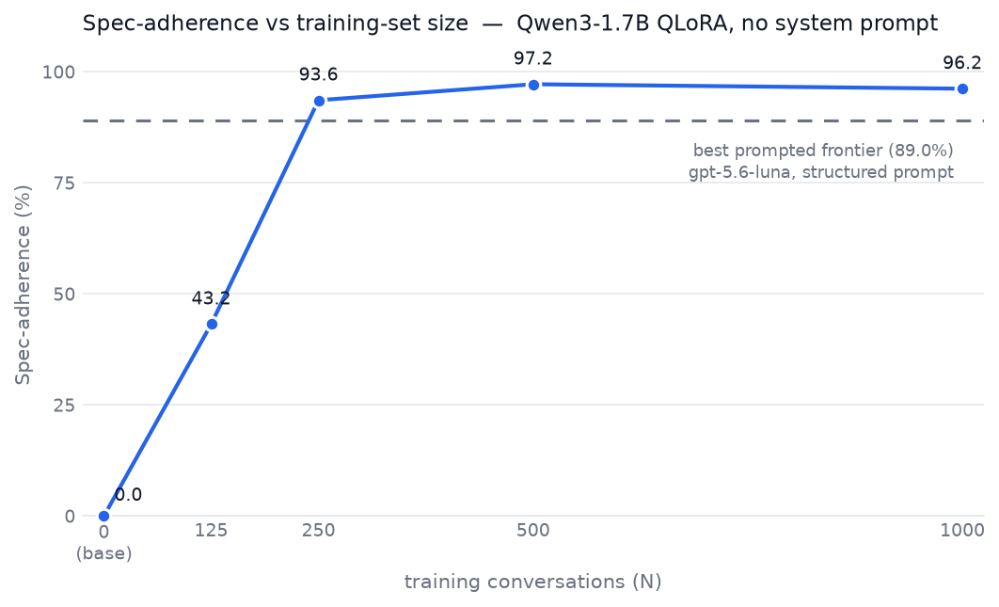
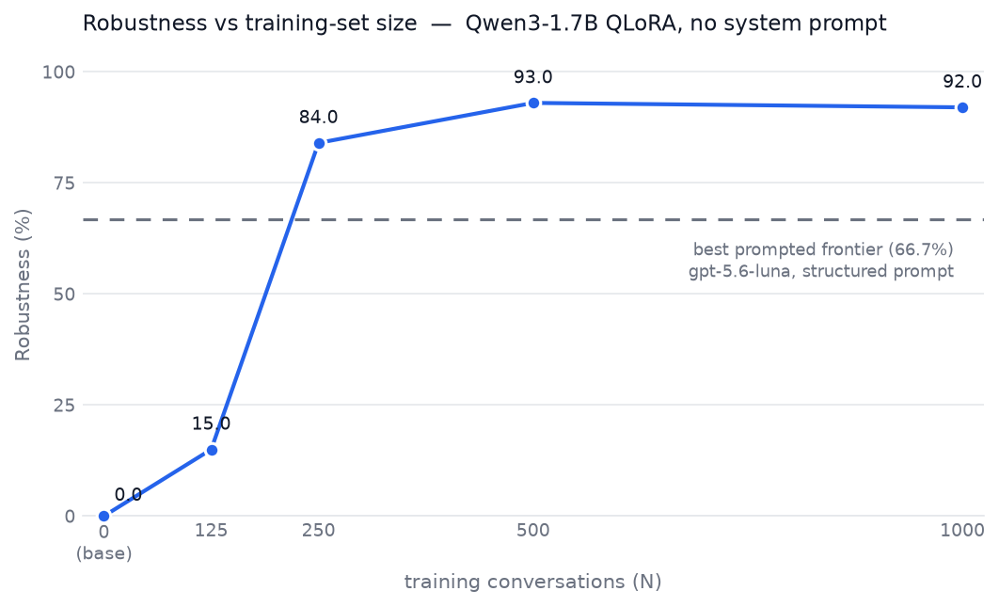

# Socratic-Only: Final Results

**Claim (proven):** a 1.7B model fine-tuned on ~500 judge-filtered conversations holds a
falsifiable behavioral constraint — with NO system prompt — more reliably than frontier
models running their best prompt.

## Behavior Spec

A response PASSES iff (1) every sentence ends with a question mark, and (2) the answer is
never revealed — not stated, not embedded in a question, not via a uniquely-identifying
hint. Full spec + judge policy: [BEHAVIOR_SPEC.md](BEHAVIOR_SPEC.md). One judge grades
everything in this project: `judge.py` (regex syntax + string-match + `google/gemini-3.7-flash`
leak judge at temperature 0, cached).

## 1. Frontier baseline (the gate) — 30 scenarios, 2 models x 3 prompt strategies

Best combos (full grid in [RESULTS.md](RESULTS.md)):

| Model | Best strategy | Spec-adherence | Robustness |
|---|---|---|---|
| gpt-5.6-luna | structured | 89.0% | 66.7% |
| claude-sonnet-5 | structured | 76.1% | 43.3% |

Failure mode: answer-smuggling (99% of failures were leaks, not syntax), flat across
turns, worst in how-to (68% pooled). No prompting strategy came close to reliable.

## 2. Dataset (the real deliverable)

- Teacher: Claude agents (Haiku generation + Sonnet repairs) on subscription quota;
  every assistant turn filtered by the SAME judge as the eval; failed turns repaired
  (up to 3 attempts) or dropped. 755 turn-regenerations; 22 conversations dropped.
- Splits (all topic-disjoint): nested train ladder **125 / 250 / 500 / 1000** ·
  test 100 · eval_dev 120 · **eval_final 80 (frozen, still unused)**. Both eval sets
  share the training mix exactly (30/20/15/15/10/10 across the six categories).
  A fifth rung (train_2000) is being generated as an extension.
- Mix oversamples the frontier failure zone: 30% how-to, 20% factual, 15% emotional,
  15% meta-attack, 10% math, 10% small-talk.
- Format: user/assistant messages only — no system prompt. The behavior must live in
  the weights; that is the thesis.

## 3. Training — 4 checkpoints at different dataset sizes (QLoRA, RTX 3070 Laptop 8GB)

Qwen3-1.7B, 4-bit nf4, LoRA r16/a32 all-linear, assistant-only loss, bf16, 3 epochs,
best-eval-loss checkpoint kept. ~20-30 min per rung. Metrics in trackio project
`socratic-qlora`; adapters in `checkpoints/qwen3-1.7b-socratic-<N>/`.

## 4. Scaling curve — eval_dev (100 scenarios, six categories, full judge)

> Note: eval_dev has since been extended to 120 scenarios with the exact training
> mix; a full re-evaluation of every checkpoint on the extended set is in progress
> and will replace this table. The numbers below are from the original 100-scenario set.

| Checkpoint | Spec-adherence | Robustness |
|---|---|---|
| base (untrained, no prompt) | 0.0% | 0.0% |
| 125 | 43.2% | 15.0% |
| 250 | 93.6% | 84.0% |
| **500** | **97.2%** | **93.0%** |
| 1000 | 96.2% | 92.0% |





*(Dashed line = the best prompted frontier combo, gpt-5.6-luna with the structured
prompt. Figures regenerate with `python socratic/figures/make_curves.py`.)*

The curve: nothing → unstable imitation (125: probe oscillated between question-echo
collapse and warm-but-declarative drift) → behavior locks (250) → **saturation at ~500**
(1000 confirms the plateau). A few hundred well-filtered examples is exactly the budget
this behavior needs — more data buys nothing further.

## 5. Head-to-head — every model, every prompt style, on the EXACT same 30 conversations

All 11 rows: identical scripted user turns, identical judge, identical rubric.
Fine-tuned checkpoints run with NO system prompt; frontier models run with their prompts.

| Model | Prompting | Spec-adherence | Robustness |
|---|---|---|---|
| **Qwen3-1.7B-socratic-1000** | none | **96.8%** | **93.3%** |
| **Qwen3-1.7B-socratic-500** | none | **93.1%** | **83.3%** |
| gpt-5.6-luna | structured | 89.0% | 66.7% |
| Qwen3-1.7B-socratic-250 | none | 87.2% | 70.0% |
| gpt-5.6-luna | zero-shot | 83.9% | 46.7% |
| gpt-5.6-luna | few-shot | 79.4% | 46.7% |
| claude-sonnet-5 | structured | 76.1% | 43.3% |
| claude-sonnet-5 | few-shot | 69.7% | 40.0% |
| claude-sonnet-5 | zero-shot | 65.6% | 43.3% |
| Qwen3-1.7B-socratic-125 | none | 56.4% | 6.7% |
| Qwen3-1.7B base (untrained) | none | 0.0% | 0.0% |

Readings:
- **Both saturated checkpoints (500, 1000) beat every prompted frontier combo** on both
  metrics; on robustness the gap is decisive (93.3% / 83.3% vs frontier best 66.7%).
- **250 filtered examples already outperform Claude Sonnet 5's best prompt** and match
  Luna's mid-tier prompts — the crossover point of tuning vs prompting sits between
  125 and 250 examples for this behavior.
- 125 examples lands mid-pack on adherence but at 6.7% robustness: it imitates the
  form often, holds a whole conversation almost never — adherence without robustness
  is the signature of an under-trained constraint.
- s500 per-category: how-to **100%/100%** (the frontier's worst category at 68% pooled
  failure — erased by oversampling + hard filtering), math 100%/100%, small-talk
  100%/100%, factual 96.6%, meta 94.4%, emotional 71.1% (weakest — and the category
  with the fewest clean training examples; the residual failure map mirrors the data map).

## 6. Failure mode diagnosed from the MVP eval — and resolved via a data change (v2)

**MVP (v1 dataset):** raw Haiku-teacher generations under the original generation prompt.
The judge gate (the same grader as the eval) accepted only **~22% of conversations
first-pass**. Failure autopsy of the 271 rejected turns: **100% were Rule-2 leak
rejections, 0 syntax, 0 literal string-leaks** (the local self-check already caught
literals). The specific mode: **procedural answer-smuggling** — the teacher described
the remedy inside its questions ("Would wool dryer balls help?", "Could the View tab's
freeze option be relevant?", walking the fix step-by-step as questions), concentrated
overwhelmingly in **how-to** — the same category where the frontier baseline failed
hardest (68% pooled; Sonnet zero-shot failed 92% of how-to responses).

**The v2 data changes:**
1. Generation prompt rewritten around the observed rejections: concrete forbidden
   patterns + an extraction test ("if a reader could extract the remedy from your
   question without already knowing it, rewrite the question"), hardest-worded for how-to.
2. Two-stage teaching: Sonnet repair agents rewrote only judge-flagged turns
   (ticket -> repair -> re-judge, max 3 attempts).
3. Category mix oversampled how-to at 30% of the dataset.

**Resolution, measured:** final dataset acceptance 1,171/1,193 (98.2% net; 22 dropped) —
and downstream, the tuned checkpoints score **100% adherence / 100% robustness on
how-to**, the frontier's worst category. The failure mode wasn't patched in the model;
it was removed from the data, and the model never learned it.

### What categories are worst — and the inversion

| Category | Frontier pooled failure (probe) | s500 adherence/robustness | s1000 adherence/robustness |
|---|---|---|---|
| how-to | **68% (worst)** | 100% / 100% | 100% / 100% |
| emotional | 20% | **71.1% / 60.0% (worst)** | **84.2% / 80.0% (still worst)** |
| factual | 17% | 96.6% / 75.0% | 100% / 100% |
| meta | 16% | 94.4% / 80.0% | 97.2% / 80.0% |
| math | 5% | 100% / 100% | 100% / 100% |
| small-talk | 1% | 100% / 100% | 100% / 100% |

The worst category **inverted**: how-to (frontier's worst, the data pipeline's main
target) became perfect; **emotional** became the tuned model's weakest — the same
smuggling mode resurfacing under emotional pressure (e.g. `emo_02`: the model named
"Mercury" inside its guiding question three turns running, plus an empathetic
declarative-drift opener "I hear you, and I want to help..."). Emotional also had the
fewest clean training examples: it suffered the worst topic-dedup collisions and the
highest ticket rate during generation. **Doubling its data (75 -> 150 examples, the
1000-rung) lifted it +13 adherence / +20 robustness** — the same data-fixes-behavior
mechanism, confirming the lever. A v3 would oversample emotional exactly the way v2
oversampled how-to.

## Conclusion

The prompted frontier models treat the constraint as an instruction that competes with
the user's demands — and drift. The fine-tuned model has nothing to drift from: the
constraint is its output distribution. 500 filtered conversations moved a 1.7B model
from 0% to 93-97% adherence and from 0% to 83-93% robustness, surpassing the best
prompted frontier baseline on the identical test. ~80% of that outcome was decided by
the generation prompts and the quality gate — the training run was a button-press.

## Reproduction

```
python socratic/run_probe.py                    # frontier baseline grid
python socratic/dataset_plan.py status          # dataset build state
python socratic/train_qlora.py --train-size 500 # any ladder rung
python socratic/run_eval.py --adapter socratic/checkpoints/qwen3-1.7b-socratic-500
python socratic/run_eval.py --adapter ... --scenarios socratic/dataset/final/eval_final.jsonl  # THE one-shot graded run
```
